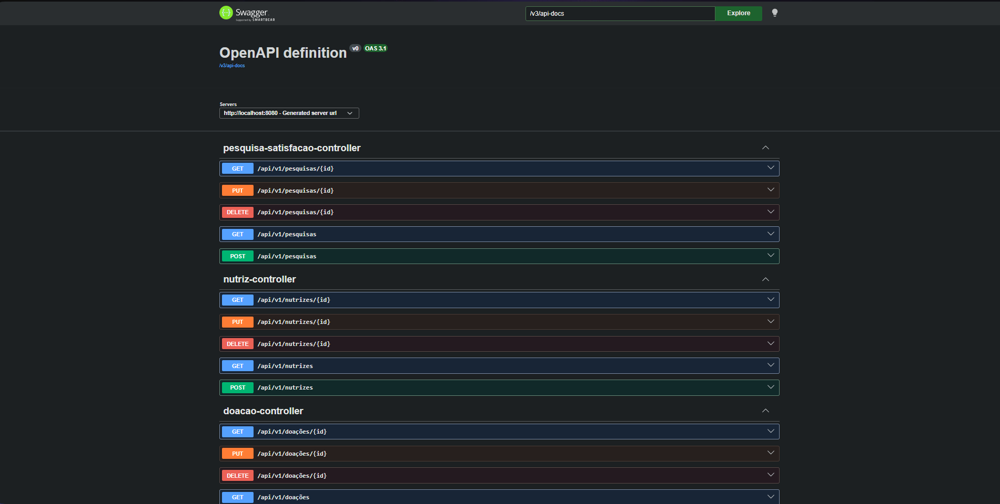
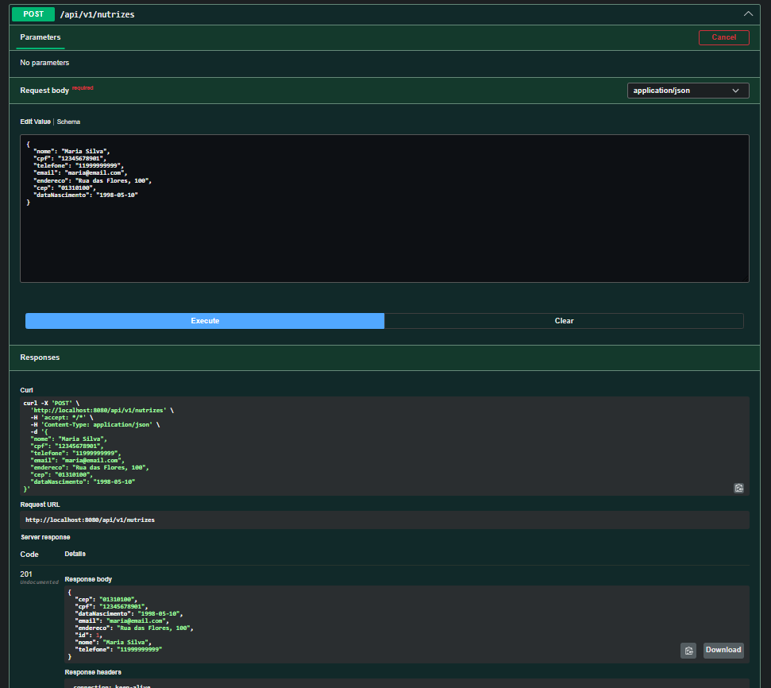
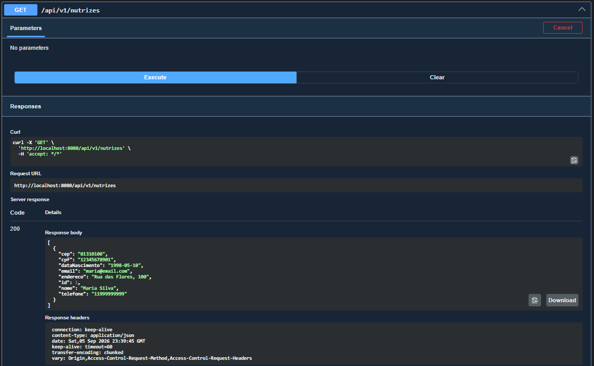
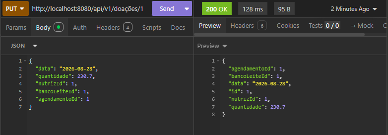
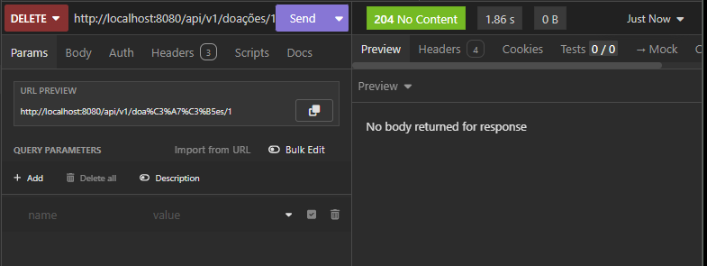
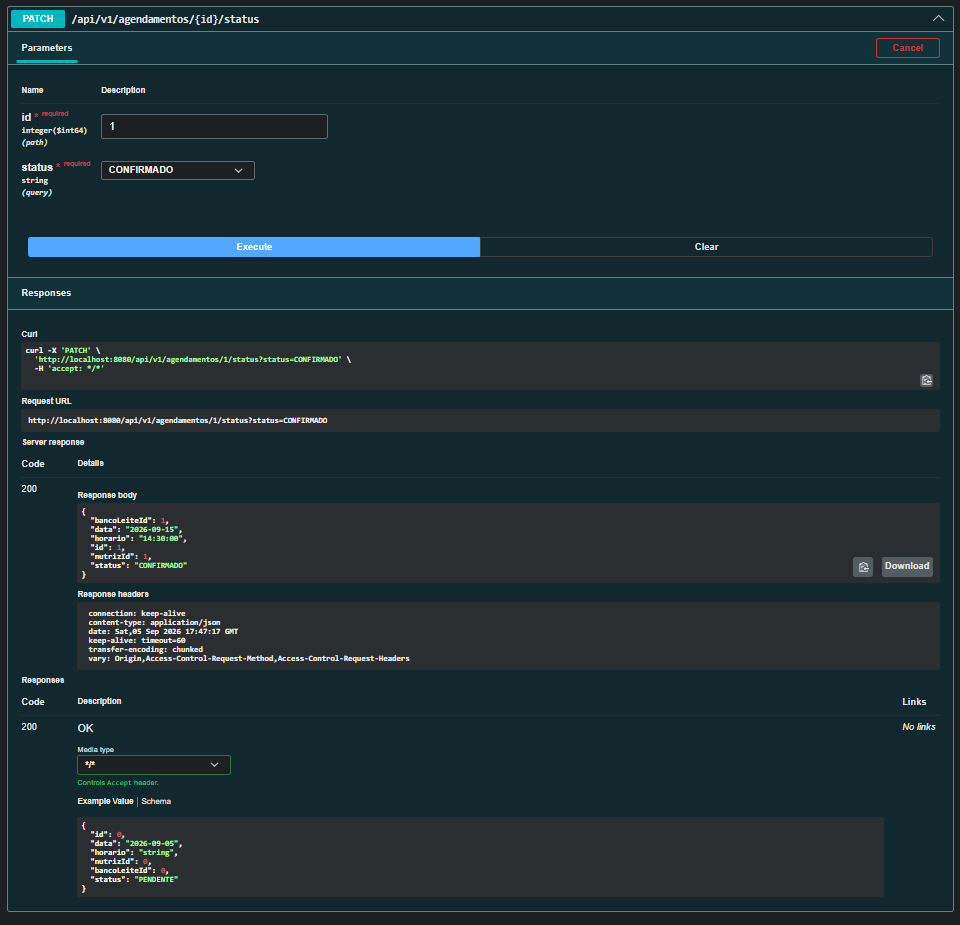
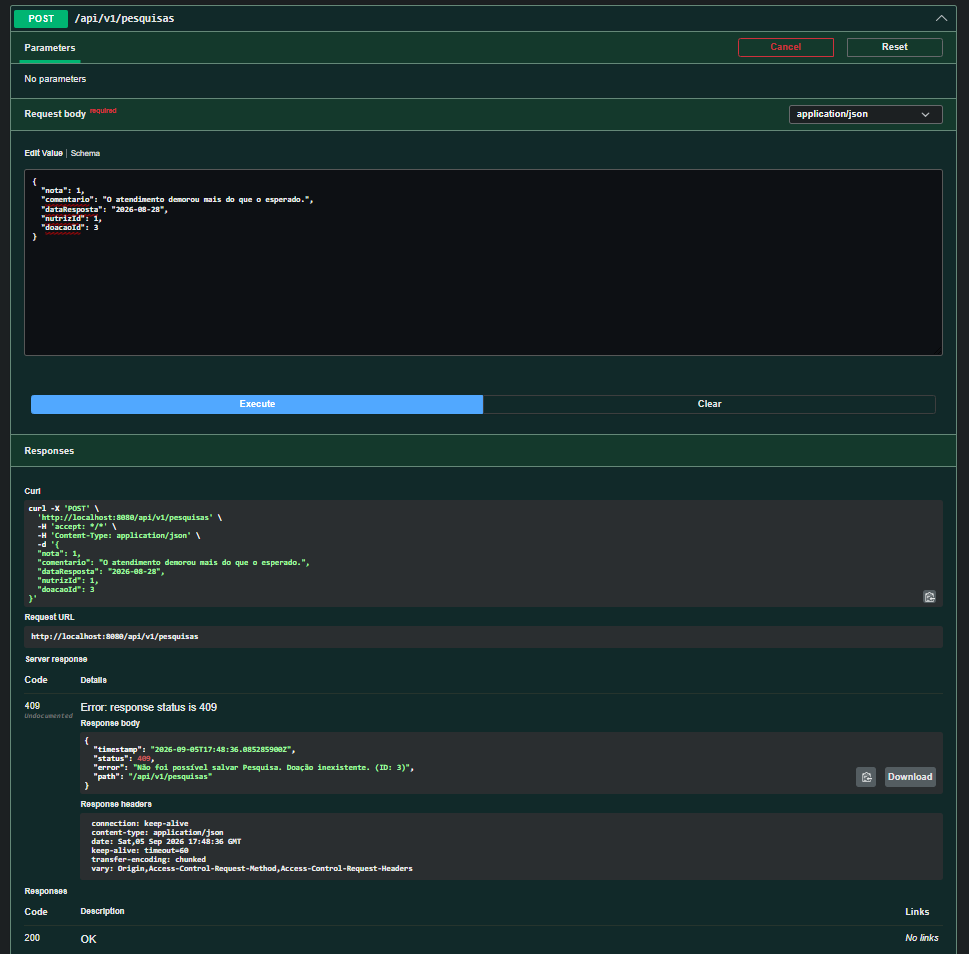

# LactareAPI

API REST desenvolvida em Java com Spring Boot para o sistema Lactare, uma solução voltada ao gerenciamento de doações de leite materno.

O backend centraliza o gerenciamento de nutrizes, bancos de leite, agendamentos, doações e pesquisas de satisfação, disponibilizando os dados por meio de uma API REST versionada.

---

## Objetivo

O LactareAPI foi desenvolvido para fornecer o backend do sistema Lactare, permitindo:

* Gerenciamento de nutrizes;
* Gerenciamento de bancos de leite;
* Registro e gerenciamento de agendamentos;
* Registro de doações;
* Registro e gerenciamento de pesquisas de satisfação;
* Validação dos dados recebidos;
* Aplicação de regras de negócio;
* Tratamento padronizado de erros;
* Persistência dos dados em banco de dados.

---

## Tecnologias

* **Java 25**
* **Spring Boot**
* **Spring Web**
* **Spring Data JPA**
* **Hibernate**
* **Bean Validation**
* **Maven**
* **Lombok**
* **Oracle Database**
* **Springdoc OpenAPI / Swagger**

---

## Arquitetura

O projeto utiliza uma arquitetura em camadas, separando as responsabilidades da aplicação:

```text
Controller
    ↓
Service
    ↓
Repository
    ↓
Database
```

### Controller

Responsável pelas requisições HTTP e pelo retorno das respostas da API.

### Service

Concentra as regras de negócio e o processamento das operações.

### Repository

Responsável pelo acesso e persistência dos dados através do Spring Data JPA.

### DTO

Define os dados de entrada e saída da API, evitando a exposição direta das entidades.

### Exceptions

Centraliza o tratamento das exceções e fornece respostas padronizadas para os erros da API.

---

## Estrutura do projeto

```text
src/
└── main/
    ├── java/
    │   └── br.com.eurofarma.lactare_api/
    │       ├── controller/
    │       ├── dto/
    │       │   ├── request/
    │       │   └── response/
    │       ├── entities/
    │       ├── exceptions/
    │       │   ├── dto/
    │       │   └── handler/
    │       ├── repository/
    │       └── service/
    │
    └── resources/
        └── application.properties
        └── application-test.properties
```

---

# Funcionalidades

A API disponibiliza operações CRUD para as principais entidades do sistema:

| Recurso                | GET | GET por ID  | POST | PUT | DELETE | PATCH |
| ---------------------- | :-: | :--------:  | :--: | :-: | :----: | :---: |
| Nutriz                 |  ✓  |      ✓     |   ✓  |  ✓  |    ✓   |   —   |
| Banco de Leite         |  ✓  |      ✓     |   ✓  |  ✓  |    ✓   |   —   |
| Agendamento            |  ✓  |      ✓     |   ✓  |  ✓  |    —   |   ✓   |
| Doação                 |  ✓  |      ✓     |   ✓  |  ✓  |    ✓   |   —   |
| Pesquisa de Satisfação |  ✓  |      ✓     |   ✓  |  ✓  |    ✓   |   —   |

---

# Endpoints

Todas as rotas utilizam o prefixo:

```text
/api/v1
```

### Nutriz

| Método | Endpoint         | Descrição           |
| ------ | ---------------- | ------------------- |
| GET    | `/nutrizes`      | Lista as nutrizes   |
| GET    | `/nutrizes/{id}` | Consulta uma nutriz |
| POST   | `/nutrizes`      | Cadastra uma nutriz |
| PUT    | `/nutrizes/{id}` | Atualiza uma nutriz |
| DELETE | `/nutrizes/{id}` | Remove uma nutriz   |

### Banco de Leite

| Método | Endpoint                | Descrição                  |
| ------ | ----------------------- | -------------------------- |
| GET    | `/bancos-de-leite`      | Lista os bancos de leite   |
| GET    | `/bancos-de-leite/{id}` | Consulta um banco de leite |
| POST   | `/bancos-de-leite`      | Cadastra um banco de leite |
| PUT    | `/bancos-de-leite/{id}` | Atualiza um banco de leite |
| DELETE | `/bancos-de-leite/{id}` | Remove um banco de leite   |

### Agendamento

| Método | Endpoint                    | Descrição               |
| ------ | --------------------------- | ----------------------- |
| GET    | `/agendamentos`             | Lista os agendamentos   |
| GET    | `/agendamentos/{id}`        | Consulta um agendamento |
| POST   | `/agendamentos`             | Cria um agendamento     |
| PUT    | `/agendamentos/{id}`        | Atualiza um agendamento |
| PATCH  | `/agendamentos/{id}/status` | Atualiza o status       |

### Doação

| Método | Endpoint        | Descrição           |
| ------ | --------------- | ------------------- |
| GET    | `/doações`      | Lista as doações    |
| GET    | `/doações/{id}` | Consulta uma doação |
| POST   | `/doações`      | Registra uma doação |
| PUT    | `/doações/{id}` | Atualiza uma doação |
| DELETE | `/doações/{id}` | Remove uma doação   |

### Pesquisa de Satisfação

| Método | Endpoint          | Descrição             |
| ------ | ----------------- | --------------------- |
| GET    | `/pesquisas`      | Lista as pesquisas    |
| GET    | `/pesquisas/{id}` | Consulta uma pesquisa |
| POST   | `/pesquisas`      | Registra uma pesquisa |
| PUT    | `/pesquisas/{id}` | Atualiza uma pesquisa |
| DELETE | `/pesquisas/{id}` | Remove uma pesquisa   |

---

# Regras de negócio

## Agendamentos

Todo novo agendamento é criado inicialmente com o status `PENDENTE`.

Os status possuem transições controladas pela API:

```text
PENDENTE
 ├── CONFIRMADO
 └── CANCELADO

CONFIRMADO
 ├── CONCLUIDO
 ├── NAO_COMPARECEU
 └── CANCELADO
```

Agendamentos finalizados não podem ter seu status alterado.

---

## Doações

Uma doação só pode ser registrada quando o agendamento relacionado estiver com o status `CONCLUIDO`.

Caso o agendamento ainda esteja pendente, confirmado ou cancelado, a API rejeita o registro da doação.

---

## Integridade dos relacionamentos

As operações consideram os relacionamentos existentes entre as entidades.

Por exemplo, uma nutriz que possui registros relacionados, como agendamentos, não pode ser removida de maneira que cause violação da integridade referencial do banco de dados.

---

# Validação

Os dados recebidos pela API são validados utilizando Bean Validation nos DTOs de requisição.

As validações impedem o cadastro ou alteração de informações inválidas antes da execução da operação.

Quando existem erros de validação, a API retorna uma resposta contendo os campos que precisam ser corrigidos.

---

# Tratamento de erros

O projeto utiliza um `GlobalExceptionHandler` para centralizar o tratamento das exceções.

| Situação                      | Status HTTP |
| ----------------------------- | ----------: |
| Recurso não encontrado        |         404 |
| Requisição inválida           |         400 |
| Parâmetro inválido            |         400 |
| Dados inválidos               |         422 |
| Conflito relacionado ao banco |         409 |
| Erro interno                  |         500 |

As respostas de erro seguem uma estrutura padronizada através dos DTOs de exceção.

---

# Banco de dados

A aplicação utiliza **Spring Data JPA** e **Hibernate** para persistência dos dados.

A configuração da conexão com o banco deve ser realizada no arquivo:

```text
src/main/resources/application.properties
```

As informações de conexão devem ser configuradas de acordo com o ambiente de execução.

---

# Como executar

## Pré-requisitos

* Java 25;
* Maven;
* Banco de dados configurado;
* Git.

## 1. Clone o repositório

```bash
git clone https://github.com/AJ-Gonzales/LactareAPI.git
```

## 2. Acesse a pasta

```bash
cd LactareAPI
```

## 3. Configure o banco de dados

Configure as informações necessárias no arquivo:

```text
src/main/resources/application.properties
```

## 4. Execute a aplicação

No Windows:

```bash
mvnw.cmd spring-boot:run
```

Ou, utilizando Maven instalado:

```bash
mvn spring-boot:run
```

A aplicação será iniciada em:

```text
http://localhost:8080
```

---

# Swagger / OpenAPI

A documentação da API é disponibilizada através do Swagger/OpenAPI.

Após iniciar a aplicação, acesse:

```text
http://localhost:8080/swagger-ui/index.html
```

O Swagger permite visualizar os endpoints, parâmetros, modelos de dados e realizar requisições diretamente pela interface.



---

# Testes

Os endpoints da API foram testados utilizando **Insomnia** e **Swagger**.

Foram realizados testes envolvendo:

* GET de todos os registros;
* GET por ID;
* POST;
* PUT;
* DELETE;
* PATCH de status de agendamento;
* validação de dados;
* consulta de recursos inexistentes;
* validação de relacionamentos;
* regras de negócio;
* tratamento de erros.

### Principais evidências

#### Cadastro e consulta de nutriz





#### Atualização e exclusão





#### Agendamento



#### Tratamento de erro



---

# Projeto relacionado

O Lactare possui uma aplicação Flutter voltada ao gerenciamento do sistema, que consome os endpoints disponibilizados por esta API.

# Repositórios

### Gestão Lactare — Flutter

https://github.com/AJ-Gonzales/gestao-lactare-flutter

### Lactare API — Java / Spring Boot

https://github.com/AJ-Gonzales/LactareAPI

---

## Projeto acadêmico

Projeto desenvolvido para a Eurofarma como parte das atividades acadêmicas do curso de Sistemas de Informação.
